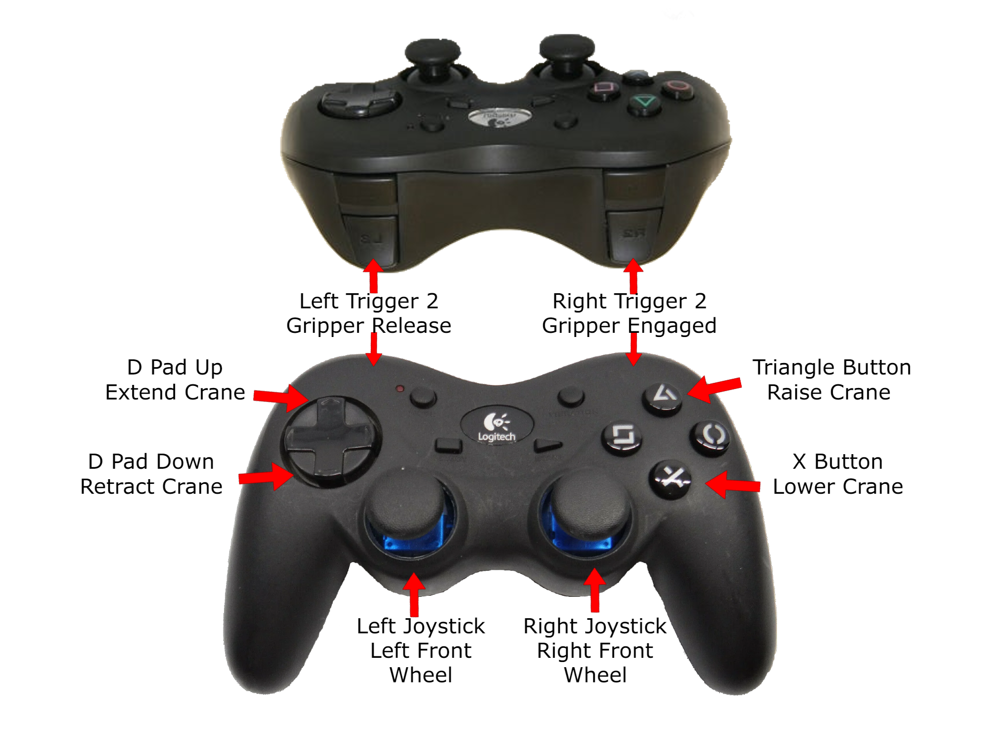
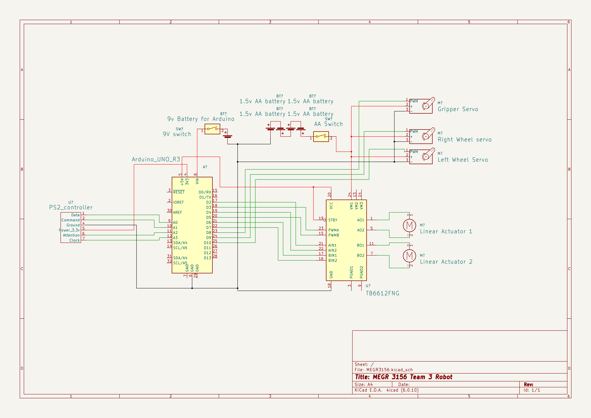

# Robot Description
The purpose of this robot is to pick up a 10.5 oz soup can and move it across the competition field. It needs to be able to raise it over a 4 inch barrier. The robot must be 12"x6"x7" and it needs to run on 4 AA batteries.
# Schematics
## Controller layout

## Electrical Schematic

# Components
- Arduino Uno
- Tb6612FNG Motor Driver
- HS-485HB Servo Motor
- FeeTech FS5103R Continuous Rotation Servo X2
- Playstation 2 controllersimage.png
- LiFes2 AA Batteries X4
- 9 volt Battery